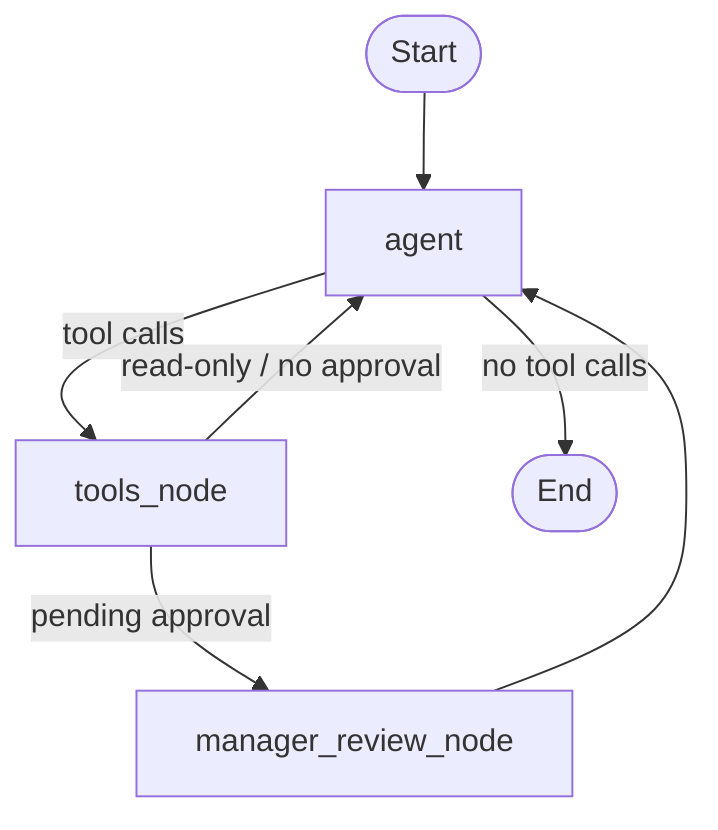

# LangGraph Diagram

```mermaid
flowchart TD
    A([Start]) --> B[agent]
    B -->|tool calls| C[tools_node]
    B -->|no tool calls| D([End])
    C -->|pending approval| E[manager_review_node]
    C -->|read-only / no approval| B
    E --> B
```
